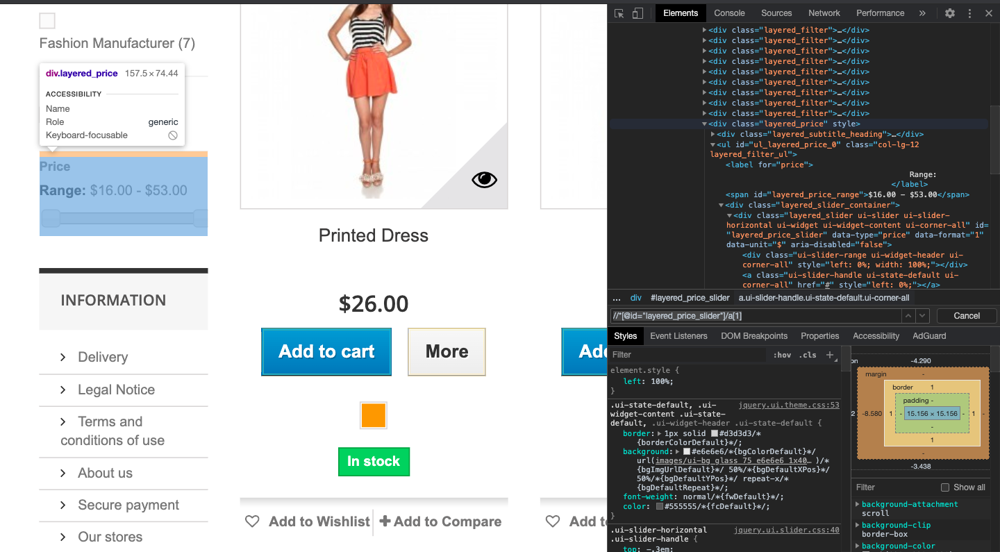
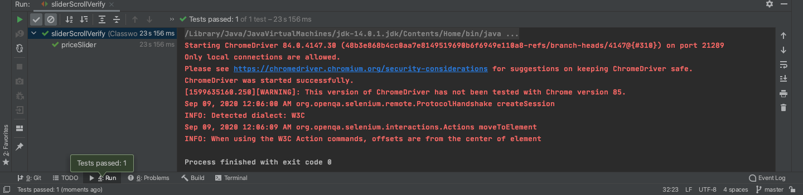
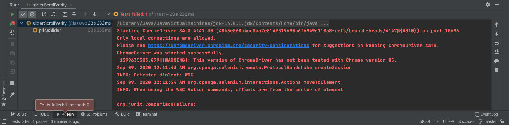

<h2> How to Scroll Slider on Website Using Selenium WebDriver and Testify using Assertion</h2>

There are many features on webpages where slider is one of them. Slider is more user friendly options than manaully typing while filtering. We can use selenium webdriver to move the slider on website like one we can see down below. Here, we are testing whether the Price slide move to all the way to left ($53). We can check the Range if it is "$53 - $53" or not after moving the slide to highest price, $53. We are using [XPath](https://en.wikipedia.org/wiki/XPath#:~:text=XPath%20(XML%20Path%20Language)%20is,Wide%20Web%20Consortium%20(W3C).) to get the price range from website.

<p align="center">
	
</p>

<br>

Lets start by following step:

Platform supporting Maven: [IntelliJ IDEA CE](https://www.jetbrains.com/idea/download/download-thanks.html?platform=mac&code=IIC)

1. Create a new Project

2. Choose [Maven](https://en.wikipedia.org/wiki/Apache_Maven#:~:text=Maven%20is%20a%20build%20automation,%2C%20Scala%2C%20and%20other%20languages.&text=Maven%20is%20built%20using%20a,application%20controllable%20through%20standard%20input.)

3. In Project SDK box, make sure you have latest version of java "JDK"

<p align="center">
	
</p>

4. Click Next, and give a name to your project, like "verifyDataProj"

5. Now create a package inside src/test/java/ and name it "verifyDataPack" then create a class inside it, name it "sliderScrollVerify".


<h4> What is Maven? </h4>

"Maven is a build automation tool used primarily for Java projects. Maven can also be used to build and manage projects written in C#, Ruby, Scala, and other languages.

Maven addresses two aspects of building software: how software is built, and its dependencies. An XML file describes the software project being built, its dependencies on other external modules and components, the build order, directories, and required plug-ins. It comes with pre-defined targets for performing certain well-defined tasks such as compilation of code and its packaging. 

Maven dynamically downloads Java libraries and Maven plug-ins from one or more repositories such as the Maven 2 Central Repository, and stores them in a local cache. Maven projects are configured using a Project Object Model, which is stored in a [pom.xml](https://github.com/kk289/Java-Slide-Scroller-Test-using-Selenium/blob/master/pom.xml) file."

An example of [pom.xml](https://github.com/kk289/Java-Slide-Scroller-Test-using-Selenium/blob/master/pom.xml) file looks like: 

```
<?xml version="1.0" encoding="UTF-8"?>
<project xmlns="http://maven.apache.org/POM/4.0.0"
         xmlns:xsi="http://www.w3.org/2001/XMLSchema-instance"
         xsi:schemaLocation="http://maven.apache.org/POM/4.0.0 http://maven.apache.org/xsd/maven-4.0.0.xsd">
    <modelVersion>4.0.0</modelVersion>

    <groupId>org.example</groupId>
    <artifactId>OpenBrowser</artifactId>
    <version>1.0-SNAPSHOT</version>
    <build>
        <plugins>
            <plugin>
                <groupId>org.apache.maven.plugins</groupId>
                <artifactId>maven-compiler-plugin</artifactId>
                <configuration>
                    <source>8</source>
                    <target>8</target>
                </configuration>
            </plugin>
        </plugins>
    </build>

    <properties>
        <project.build.sourceEncoding>UTF-8</project.build.sourceEncoding>
        <maven.compiler.source>1.7</maven.compiler.source>
        <maven.compiler.target>1.7</maven.compiler.target>
    </properties>

    <dependencies>

    	<dependency>
      		<groupId>junit</groupId>
      		<artifactId>junit</artifactId>
      		<version>4.11</version>
      		<scope>test</scope>
    	</dependency>

        <!-- https://mvnrepository.com/artifact/org.seleniumhq.selenium/selenium-java-->
    	<dependency>
      		<groupId>org.seleniumhq.selenium</groupId>
      		<artifactId>selenium-java</artifactId>
      		<version>3.141.59</version>
      		<scope>test</scope>
    	</dependency>

    	<!-- https://mvnrepository.com/artifact/org.seleniumhq.selenium/selenium-api -->
    	<dependency>
      		<groupId>org.seleniumhq.selenium</groupId>
      		<artifactId>selenium-api</artifactId>
     		<version>3.141.59</version>
      		<scope>test</scope>
    	</dependency>

    </dependencies>

</project>
```

9. Make sure to setup your "pom.xml" file like above. Just replace your pom.xml file with this [pom.xml](https://github.com/kk289/Java-Slide-Scroller-Test-using-Selenium/blob/master/pom.xml)

10. Let's look at "sliderScrollVerify" class:

## sliderScrollVerify

```
package verifyDataPack;

import org.junit.Assert;
import org.junit.After;
import org.junit.Before;
import org.junit.Test;
import org.openqa.selenium.By;
import org.openqa.selenium.JavascriptExecutor;
import org.openqa.selenium.WebDriver;
import org.openqa.selenium.WebElement;
import org.openqa.selenium.chrome.ChromeDriver;
import org.openqa.selenium.interactions.Action;
import org.openqa.selenium.interactions.Actions;

public class sliderScrollVerify {

    WebDriver wd;

    @Before
    // Open ChromeBrowser
    public void openBrowser() {
        System.setProperty("webdriver.chrome.driver", "/usr/local/bin/chromedriver"); // chrome browser
        wd = new ChromeDriver();
        wd.get("http://automationpractice.com/index.php?id_category=3&controller=category");
    }

    @Test
    public void priceSlider() throws InterruptedException{
        // Scroll down
        JavascriptExecutor js = (JavascriptExecutor) wd;
        js.executeScript("window.scrollBy(0,1000)");
        Thread.sleep(2000);

        int target = 53;
        int method = 2;  // Choose 1-4 method
        WebElement slide = wd.findElement(By.xpath("//*[@id='layered_price_slider']/a[1]"));
        Actions move = new Actions(wd);
        if (method == 1){
            for (int i = 1; i <= target; i++){
                // Slider.sendKeys(Keys.ARROW_RIGHT)
                Action action = move.dragAndDropBy(slide, i, 0).build();
                action.perform();
            }
        }
        if (method == 2){
            move.dragAndDropBy(slide,300,0).build().perform();
        }
        if (method == 3){
            move.moveToElement(slide).clickAndHold().moveToElement(slide, 300, 0).release().perform();
        }
        if (method == 4){
            js.executeScript("arguments[0].setAttribute('style', 'left: 100%;')", slide);
        }

        Thread.sleep(3000);  // verify the level is 53

        // Assertion
        Assert.assertEquals(wd.findElement(By.id("layered_price_range")).getText(), "$53.00 - $53.00");
    }

    @After
    // Close the browser
    public void Close() throws InterruptedException {
        Thread.sleep(2000);
        wd.quit();
    }
}
```

There are altogether four methods to scroll the slider on website. 

Method 1 is using for-loop where it runs until it doesn't find the end of the loop. so it may takes some time. It runs 100% but we just need to wait until loop finish. I recommend to use either method 2 or 3.

If we look at the method 3 (also method 2), remember this: moveToElement() or dragAndDropBy() need three variables which are WebElement, xOffSet, yOffSet. In our case right now, we define WebElement as slide. Here we only have horizontal slide bar so we just need xOffSet, so we keep 300 for xOffSet. yOffSet remains 0. For vertical slider, we need to keep xOffSet to 0 and change yOffSet.

NOTE: Method 4 only move the slider, it doesn't change the data. Just use method 1-3 only this time. I'm still working on method 4. 

Let's run the "verifySum" class using Method 3. 

We get following result: 

<p align="center">
	
	<br>
	<br>
	
	<br>
	<br>
	
</p>

<br>

The program runs successfully. For testing part, the assertion passed with same amount of price range: $53 - $53.

We can also input some wrong price range in assertion, and we should expect the following result where the test is failed because the expected price range doesnt match with actual price range.

<p align="center">
	
</p>

<br>

<b>Thank you. Let me know if you have any questions.</b>
